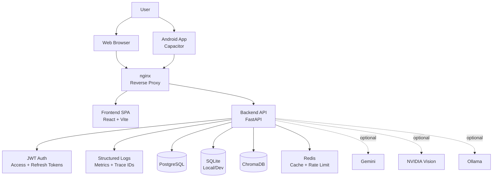

# Architecture

## Overview

This repository is a full-stack monorepo for `DrugGuard`, a drug-safety application with three major product capabilities:

1. Generic drug-drug interaction checking.
2. Diabetic patient-specific medication risk analysis.
3. Prescription OCR, extraction, and RAG-based question answering.

The codebase is organized into:

- `backend/`: FastAPI application, database models, domain services, ML, OCR, and RAG.
- `frontend/`: React + Vite single-page application with web and Android-capable UI.
- `abstract/`: generated documentation, papers, screenshots, APK artifacts, and supporting documentation assets.
- Root scripts and Docker files: local development and container deployment entrypoints.

At runtime, the repository now supports two deployment modes:

- Local/developer mode
  - Frontend SPA
  - FastAPI backend
  - SQLite or PostgreSQL
  - ChromaDB + Redis
- Production/container mode
  - nginx edge proxy
  - Frontend SPA container
  - FastAPI backend container
  - PostgreSQL + Redis + ChromaDB persistence/supporting stores

## System Architecture

### High-level runtime topology

```text
Browser / Android App
        |
        v
nginx reverse proxy
        |
        +--> React SPA (served static assets)
        |
        +--> FastAPI Backend
              |- Auth + user-scoped APIs
              |- Core interaction APIs
              |- Diabetic risk APIs
              |- Prescription OCR + RAG APIs
              |- Health / admin / metrics APIs
                      |
                      +--> PostgreSQL or SQLite
                      +--> ChromaDB persistent vector store
                      +--> Redis cache + rate limiter
                      +--> Optional external AI/model providers
                            |- Gemini
                            |- NVIDIA vision
                            |- Ollama
```

### Mermaid system diagram



### Architectural style

The backend uses a pragmatic feature-oriented modular architecture:

- Routers define HTTP contracts.
- Services hold business logic and orchestration.
- SQLAlchemy models define persistence.
- Shared infrastructure lives in `app/core`, `app/services`, and `app/database.py`.

It is not strict clean architecture or DDD, but it does separate concerns by feature domain and by infrastructure layer.

The frontend uses a route-based SPA architecture:

- `App.jsx` defines top-level routes and shell layout.
- Feature pages encapsulate large user workflows.
- Shared API access is centralized in `src/services/api.js`.
- Cross-page domain state is centralized with Zustand stores (`useDrugStore`, `useDiabetesStore`, `usePrescriptionStore`).
- Component-local state is reserved for transient UI concerns such as modal visibility, drag state, and in-progress form inputs.

## Repository Structure

```text
.
|- backend/
|  |- app/
|  |  |- api/              # top-level app routers and health endpoints
|  |  |- core/             # app factory support: logging, middleware, lifespan
|  |  |- diabetic/         # diabetic patient risk domain
|  |  |- ml/               # generic ML training/inference/scheduler
|  |  |- prescription/     # prescription OCR + RAG domain
|  |  |- routers/          # generic drug, interaction, OCR, admin, history routers
|  |  |- services/         # shared infra and cross-domain services
|  |  |- config.py         # settings
|  |  |- database.py       # SQLAlchemy engine/session/base
|  |  |- main.py           # FastAPI app entrypoint
|  |  |- models.py         # core SQLAlchemy models
|  |  `- schemas.py        # core Pydantic schemas
|  |- tests/
|  |- alembic/
|  |- data/
|  |- models/
|  `- chroma_db/
|- frontend/
|  |- src/
|  |  |- components/
|  |  |- context/
|  |  |- hooks/
|  |  |- services/
|  |  |- stores/
|  |  `- utils/
|  |- android/
|  `- public/
|- abstract/
|- docker-compose.yml
|- run_app.bat
`- build_all.bat
```

## Backend Architecture

### Application composition

The backend entrypoint is `backend/app/main.py`.

App assembly is split into dedicated modules:

- `app/main.py`
  - creates the FastAPI application
  - includes routers
  - registers health/statistics endpoints
- `app/services/logging_setup.py`
  - configures structured JSON logging
  - injects request IDs and trace IDs into log records
- `app/services/http_middleware.py`
  - configures CORS
  - adds request tracing, timing, and Prometheus-style metrics
  - applies global rate limiting
- `app/services/app_lifespan.py`
  - validates startup configuration
  - initializes model metadata
  - expects Alembic to manage production schema changes
  - starts/stops the ML scheduler
- `app/api/router.py`
  - registers versioned `/v1/...` and legacy unprefixed routes
- `app/api/health.py`
  - root, health, readiness, external API health, and statistics endpoints

### Core backend layers

#### 1. Configuration and startup

- `app/config.py`
  - loads environment-driven settings through `pydantic-settings`
  - defines database URLs, API keys, model settings, Redis settings, and feature flags
- `app/core/lifespan.py`
  - enforces optional production startup validation
  - initializes database tables
  - starts ML retraining scheduler

#### 2. Persistence layer

- `app/database.py`
  - defines the async SQLAlchemy engine
  - exposes `AsyncSession` dependency
  - owns the declarative `Base`
  - supports SQLite for local development and pooled PostgreSQL in production
  - only auto-creates tables when `DB_AUTO_CREATE=true`
  - otherwise expects Alembic migrations to provision the schema

Persistence technologies:

- PostgreSQL
  - primary transactional database for production deployments
- SQLite
  - lightweight local-development fallback
- ChromaDB
  - vector store for prescription RAG
- Redis
  - cache and rate limiting support

#### 3. API layer

Routers are split between generic APIs and feature modules.

Generic routers in `app/routers/`:

- `drugs.py`
  - browse/search/get drug details and side effects
- `interactions.py`
  - check pairwise and batch interactions
  - provide alternatives
- `ocr.py`
  - generic image OCR endpoints
- `history.py`
  - interaction/comparison history
- `ml_router.py`
  - ML model inspection and prediction endpoints
- `adherence.py`
  - medication adherence endpoints
- `admin.py`
  - system/admin APIs protected by API key

Feature routers:

- `app/diabetic/router.py`
  - diabetic patient CRUD
  - medication management
  - patient-specific risk checking
  - alternative suggestions
  - report generation
  - lab-report analysis
- `app/prescription/router.py`
  - prescription upload
  - OCR extraction
  - chat
  - history
  - interaction checking for extracted medicines

#### 4. Service layer

The service layer contains the bulk of business logic.

Core shared services in `app/services/`:

- `interaction_service.py`
  - core interaction lookups
  - fuzzy drug lookup
  - alternative generation
- `comparison_logger.py`
  - stores interaction query audit logs
- `cache.py`
  - Redis-backed JSON caching helpers
- `rate_limiter.py`
  - Redis-backed fixed-window request limiting
- `api_client.py`, `robust_fetcher.py`, `data_fetcher.py`
  - external API fetch orchestration and resilience
- `gemini_client.py`
  - normalized Gemini wrapper across SDK variants
- `nvidia_vision_client.py`
  - NVIDIA vision integration
- `ocr_service.py`
  - generic OCR service for drug extraction
- `pdf_generator.py`
  - PDF report generation
- `auth.py`
  - admin/API-key auth helpers

### Backend feature modules

#### Core drug interaction module

Files:

- `app/models.py`
- `app/schemas.py`
- `app/routers/drugs.py`
- `app/routers/interactions.py`
- `app/services/interaction_service.py`

Responsibilities:

- drug catalog search and retrieval
- pairwise interaction checking
- batch prescription interaction checking
- safe alternative lookup
- interaction query logging and ML audit fields

Decision model:

- rules/database result is always available when the pair exists
- generic ML may augment or lead if models are loaded
- major and contraindicated rules override ML for safety

#### Diabetic patient risk module

Files:

- `app/diabetic/models.py`
- `app/diabetic/schemas.py`
- `app/diabetic/router.py`
- `app/diabetic/service.py`
- `app/diabetic/rules.py`
- `app/diabetic/ml_predictor.py`
- `app/diabetic/ml_predictor_v2.py`
- `app/diabetic/smart_model.py`
- `app/diabetic/llm_explainer.py`
- `app/diabetic/lab_report_analyzer.py`

Responsibilities:

- manage diabetic patient profiles
- store patient medications and clinical context
- evaluate drug risk using diabetic-specific rules
- augment risk scoring with ML
- reconcile rules and ML via a smart arbitration layer
- generate reports and explanations
- analyze uploaded lab reports

This is the most domain-specific subsystem in the repository.

#### Prescription OCR + RAG module

Files:

- `app/prescription/models.py`
- `app/prescription/schemas.py`
- `app/prescription/router.py`
- `app/prescription/service.py`
- `app/prescription/vision_ocr.py`
- `app/prescription/rag_service.py`
- `app/prescription/langgraph_rag.py`
- `app/prescription/langchain_rag_kb.py`
- `app/prescription/knowledge_base.py`
- `app/prescription/web_knowledge_base.py`

Responsibilities:

- accept prescription images/PDFs
- extract medicines and medication details
- store extracted content and processing metadata
- index extracted text into ChromaDB
- support contextual chat over a prescription
- retrieve external drug knowledge when available

OCR and extraction strategy:

1. NVIDIA vision if configured.
2. Gemini vision if configured.
3. Ollama OCR/LLM fallback.
4. Regex extraction fallback.

RAG architecture:

- SQL database stores prescriptions, medicines, and chat history.
- ChromaDB stores semantic chunks for retrieval.
- LangGraph coordinates question classification, retrieval, optional drug lookup, and response generation.

#### Generic ML module

Files:

- `app/ml/predictor.py`
- `app/ml/trainer.py`
- `app/ml/feature_engineering.py`
- `app/ml/explainability_service.py`
- `app/ml/bayesian_optimizer.py`
- `app/ml/scheduler.py`

Responsibilities:

- generic interaction ML inference
- model training and optimization
- explainability
- scheduled retraining hooks

### Backend request-processing concerns

Common request pipeline:

1. Request enters FastAPI app.
2. CORS middleware applies.
3. request-context middleware assigns `X-Request-ID`, timing, and rate limiting.
4. Router validates request via Pydantic schemas.
5. Router delegates to a service.
6. Service reads/writes PostgreSQL or SQLite and optionally other stores/providers.
7. Response is returned with timing, request ID, and trace ID headers.
8. Structured JSON logs capture request metadata.

## Frontend Architecture

### Frontend stack

- React 18
- Vite
- React Router
- Zustand
- Framer Motion
- Capacitor for Android packaging
- Tailwind CSS and custom styles

### Frontend structure

`frontend/src/` is organized into application shell, feature components, and shared utilities.

#### Entry files

- `main.jsx`
  - bootstraps React app
  - registers service worker
- `App.jsx`
  - application shell
  - route definitions
  - navbar/footer/background
  - lazy-loaded route features

#### Routes

Routes defined in `App.jsx`:

- `/`
  - main interaction checker
- `/ml-dashboard`
  - model status and ML details
- `/diabetes`
  - diabetic patient workflow
- `/prescription`
  - prescription scanner and RAG chat
- `/patient-prescription`
  - patient-specific prescription scanning workflow
- `/system-status`
  - health and admin-style status UI

#### Components

Major generic UI components:

- `Navbar.jsx`
- `Hero.jsx`
- `InteractionChecker.jsx`
- `CameraCapture.jsx`
- `ResultsDisplay.jsx`
- `AlternativesDisplay.jsx`
- `MLPrediction.jsx`
- `Footer.jsx`
- `SystemStatus.jsx`

Feature-heavy components:

- `DiabetesManager.jsx`
  - patient management
  - medication management
  - report upload/analysis
  - risk checks
- `PrescriptionRAG.jsx`
  - upload
  - camera capture
  - extracted medicine display
  - chat history and RAG interaction

#### State management

The frontend uses mixed state patterns.

Centralized Zustand state:

- `stores/useDrugStore.js`
  - generic interaction results
  - alternatives
  - ML prediction state
  - loading flags
  - active input tab
  - search state

Component-local state:

- `DiabetesManager.jsx`
  - patient and report workflow state
- `PrescriptionRAG.jsx`
  - upload, chat, camera, and warning state

This means the frontend is partially centralized and partially component-scoped.

#### API integration

Shared API access lives in `src/services/api.js`.

Responsibilities:

- base URL resolution
- request timeouts
- JSON request boilerplate
- request-id aware error messages
- wrappers for:
  - drug endpoints
  - interaction endpoints
  - ML endpoints
  - history endpoints
  - prescription endpoints
  - admin/system status

Platform-aware backend URL selection is implemented in `src/utils/platform.js`.

Behavior:

- native Capacitor app prefers `VITE_API_URL_MOBILE`
- web prefers `VITE_API_URL`
- falls back to `http://localhost:8000`

### Frontend rendering flow

Typical generic interaction flow:

1. User enters drugs in the home page.
2. `useDrugStore.checkInteraction()` calls backend interaction API.
3. Store updates results state.
4. Store triggers ML prediction request.
5. If interaction exists, store requests alternatives.
6. UI renders results, ML panel, and alternatives.

Prescription flow:

1. User uploads or captures a prescription.
2. Frontend sends file or base64 image.
3. Backend returns extracted medicines and prescription ID.
4. Frontend can ask chat questions or run interaction checks across extracted medicines.

## Database Schema

The database is split into three logical domains plus supporting operational tables.

### 1. Core drug and interaction domain

Defined in `backend/app/models.py`.

#### `drugs`

Stores canonical drug metadata.

Key columns:

- `id`
- `drugbank_id`
- `name`
- `generic_name`
- `brand_names`
- `description`
- `drug_class`
- `mechanism`
- `indication`
- `molecular_formula`
- `molecular_weight`
- `is_approved`

#### `categories`

Drug therapeutic categories/classes.

#### `drug_categories`

Many-to-many join table between drugs and categories.

#### `drug_interactions`

Stores known pairwise drug interactions.

Key columns:

- `drug1_id`
- `drug2_id`
- `severity`
- `description`
- `effect`
- `mechanism`
- `management`
- `source`
- `evidence_level`
- `confidence_score`

#### `drug_similarities`

Supports alternative suggestions.

Key columns:

- `drug1_id`
- `drug2_id`
- `structural_similarity`
- `therapeutic_similarity`
- `overall_similarity`

#### `comparison_logs`

Audit table for user interaction checks.

Key columns:

- `drug1_name`
- `drug2_name`
- `has_interaction`
- `is_safe`
- `severity`
- `ml_probability`
- `ml_severity`
- `ml_decision_source`
- `rule_override_reason`
- `ip_address`
- `user_agent`
- `timestamp`

#### `ml_predictions`

Stores generic ML prediction outputs.

#### `model_metrics`

Stores model performance history.

#### `optimization_results`

Stores hyperparameter optimization runs.

#### `twosides_interactions`

Dataset-derived interaction records.

#### `offsides_effects`

Dataset-derived adverse effect records.

#### `medication_schedules`

Medication schedule/tracking table.

#### `adherence_logs`

Medication adherence event tracking.

### 2. Diabetic domain

Defined in `backend/app/diabetic/models.py`.

#### `diabetic_patients`

Stores patient-specific diabetic clinical context.

Key columns:

- patient identity: `patient_id`, `name`, `age`, `gender`
- body metrics: `weight_kg`, `height_cm`
- diabetes metadata: `diabetes_type`, `years_with_diabetes`
- labs: `hba1c`, `fasting_glucose`, `postprandial_glucose`, `mean_blood_glucose`, `egfr`, `creatinine`, `potassium`, `alt`, `ast`
- lipid profile: `total_cholesterol`, `triglycerides`, `hdl_cholesterol`, `ldl_cholesterol`, `vldl_cholesterol`
- complications: nephropathy, retinopathy, neuropathy, cardiovascular disease, hypertension, hyperlipidemia, obesity
- `allergies`, `comorbidities`

#### `diabetic_medications`

Stores medications linked to a diabetic patient.

#### `diabetic_drug_risks`

Stores risk assessments of a drug for a specific diabetic patient.

Includes:

- `risk_level`
- `risk_score`
- risk factors
- recommendation
- alternatives
- monitoring requirements
- interacting medications

#### `diabetic_drug_rules`

Stores curated diabetic drug rules.

Includes:

- base risk
- nephropathy/cardiovascular conditional risks
- eGFR and potassium thresholds
- blood glucose effect metadata
- warning and guidance text
- safer alternatives

### 3. Prescription domain

Defined in `backend/app/prescription/models.py`.

#### `prescriptions`

Top-level uploaded prescription record.

Key columns:

- `user_id`
- `filename`
- `file_type`
- `file_size`
- `raw_text`
- `extraction_confidence`
- `status`
- `error_message`
- `vision_model_used`
- `processed_at`
- `chroma_collection_id`

#### `prescription_medicines`

Medicines extracted from a prescription.

Includes:

- `name`
- `generic_name`
- `quantity`
- `dosage`
- `frequency`
- `duration`
- `instructions`
- parsed timing flags: `morning`, `afternoon`, `evening`, `night`

#### `prescription_chats`

Chat history over a prescription.

Includes:

- `role`
- `content`
- `retrieved_context`
- `model_used`

### 4. Vector store schema

ChromaDB is a second persistence plane used by the prescription module.

Collection strategy:

- one collection per prescription
- collection name: `prescription_<id>`

Stored documents:

- raw extracted prescription text
- one document per extracted medicine
- a prescription summary document

Metadata stored with vector documents:

- `type`
- `prescription_id`
- `medicine_name` when relevant

## Request Flow

### Generic drug interaction request flow

Example endpoint:

- `POST /interactions/check`

Flow:

1. Frontend calls `checkInteraction()` in `frontend/src/services/api.js`.
2. Request reaches FastAPI router in `app/routers/interactions.py`.
3. Router validates `InteractionCheckRequest`.
4. Router creates `InteractionService`.
5. Service resolves both drugs from PostgreSQL or SQLite.
6. Service looks up known interaction in `drug_interactions`.
7. Router optionally loads generic ML predictor and computes ML result.
8. Router applies hybrid arbitration:
   - rules-only if ML unavailable
   - ML primary if available
   - rule override for major/contraindicated cases
9. Router writes audit information into `comparison_logs`.
10. Response returns to frontend with request ID and timing headers.

### Diabetic risk-check request flow

Example endpoint:

- `POST /diabetic/risk-check`

Flow:

1. Frontend submits patient ID and drug name.
2. Frontend includes a bearer token obtained from the JWT auth flow.
3. Router resolves the current user and delegates to `DiabeticDDIService`.
4. Service loads the user-owned patient and current medications.
5. Service builds patient context from labs, complications, and demographics.
6. Rule engine computes diabetic drug risk.
7. V2 ML predictor is attempted; V1 predictor is fallback.
8. Smart-model arbitration reconciles rule and ML outputs.
9. Response returns risk level, recommendations, and optional ML metadata.
10. Separate LLM endpoint may be called afterward for slower narrative analysis.

### Prescription upload and chat flow

Example endpoints:

- `POST /prescription/upload`
- `POST /prescription/chat`

Upload flow:

1. Frontend uploads image/PDF.
2. Backend creates a `prescriptions` row with `processing` status.
3. Vision OCR service extracts medicines.
4. Backend saves extracted medicines into `prescription_medicines`.
5. Backend indexes raw text and medicine summaries into ChromaDB.
6. Backend marks prescription `completed`.
7. Frontend receives extraction result and prescription ID.

Chat flow:

1. Frontend sends prescription ID and message.
2. Backend loads last chat messages from SQL.
3. LangGraph classifies question type.
4. RAG layer retrieves relevant chunks from ChromaDB.
5. Optional drug-knowledge retrieval augments context.
6. LLM/template response is generated.
7. User and assistant messages are persisted to `prescription_chats`.
8. Answer is returned to frontend.

### Cross-cutting request behaviors

Every request goes through:

- structured logging
- request ID generation
- trace ID generation / propagation
- processing-time measurement
- Prometheus-compatible metrics collection
- Redis-backed global rate limiting
- CORS handling

## Deployment Architecture

### Local development

Primary local workflow:

- `run_app.bat`
  - starts FastAPI backend from `backend/venv`
  - starts Vite frontend dev server

Ports:

- backend: `8000`
- frontend dev server: `5173` or `3000` depending on script/config path

Vite dev proxy:

- `/api` can proxy to backend in dev, but most frontend code currently calls the backend base URL directly through `platform.js`.

### Container deployment

Defined in `docker-compose.yml`.

Services:

#### `nginx`

- acts as the public entry point
- serves the frontend through the `frontend` service
- proxies `/api/*` and `/metrics` to the backend

#### `backend`

- builds from `backend/Dockerfile`
- runs Alembic migrations on startup before launching Uvicorn workers
- exposes container port `8000` to the internal Docker network
- mounts:
  - `/app/data`
  - `/app/models`
  - `/app/chroma_db`
  - `/app/logs`

#### `frontend`

- builds from `frontend/Dockerfile`
- serves the static SPA on container port `80`

#### `postgres`

- runs `postgres:16-alpine`
- stores transactional application data
- becomes the primary production system of record

#### `redis`

- runs `redis:7-alpine`
- supports:
  - caching
  - rate limiting
  - queue/state coordination if background processing expands later

### Mobile deployment

The frontend includes a Capacitor Android project in `frontend/android/`.

`build_all.bat` supports:

1. building the frontend bundle
2. syncing assets into Capacitor
3. running Gradle to build an Android APK
4. copying the APK to the repository root

Mobile backend connectivity:

- native app should use `VITE_API_URL_MOBILE`
- this allows the Android app to call a backend reachable on the LAN or another environment

### Persistence deployment notes

- PostgreSQL is the production system-of-record database.
- SQLite remains available as a local-development fallback.
- ChromaDB persists under `backend/chroma_db`.
- Redis is externalized as a distinct service.

The backend still remains partially stateful because:

- model artifacts are local
- ChromaDB is local persistent storage unless externalized later

### Operational characteristics

Strengths:

- simple to run locally
- single backend deployment unit
- feature-complete without a large distributed system footprint

Tradeoffs:

- backend is operationally heavy because it combines APIs, OCR, ML, LLM orchestration, and RAG in one service
- local model artifacts and ChromaDB still limit horizontal scalability unless shared storage is introduced
- vector store and model artifacts are locally coupled to the backend node

## Summary

This repository implements a monolithic-but-modular healthcare application:

- frontend SPA for interaction checking, diabetic workflows, and prescription intelligence
- backend FastAPI service split into core, diabetic, and prescription domains
- JWT authentication with access/refresh tokens for user-scoped workflows
- PostgreSQL for production transactional data, with SQLite fallback for local development
- ChromaDB for semantic retrieval
- Redis for cache and rate limiting
- nginx as the production edge proxy
- optional external AI services for OCR, LLM, and vision

The architecture remains monolithic at the service level, but it now has a clearer production path with migration-driven schema management, containerized infrastructure, structured observability, and authenticated user-scoped data flows.
